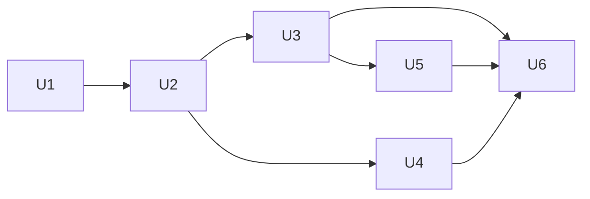

# Unit Breakdown — Flutter Stateful Widget Example ("2-statefull")

- **Intent ID**: `260930-create-new-flutter-2`
- **Source**: `technical-spec.md` §5, `implementation-plan.md`
- **Units**: 6 (one is the walking skeleton slice; all are review-sized)

Each unit is a vertical slice: it builds, lints, and (where applicable) tests on
its own. Sizes: S < 1 hour, M ≈ half a day.

---

## Walking Skeleton

**U1 + U2 + U3-core** — a scaffolded app that displays a working stateful
counter and has one passing test asserting an increment. This is the thinnest
slice that proves the architecture: framework state → `setState` → rebuild →
test. Everything after this is completeness, not risk.

---

## U1 — Scaffold the Flutter project

- **Requirement ids**: FR-5, CR-2, NFR-1
- **Acceptance criteria**
  - Given the repository root, when the tree is listed, then
    `2-statefull/flutter_application_2/pubspec.yaml`, `lib/`, and `test/` exist.
  - `pubspec.yaml` declares `name: flutter_application_2`.
  - Given the generated project, when `flutter pub get && flutter analyze &&
    flutter test` run, then `pub get` succeeds, analyze reports no issues, and
    the generated test passes.
- **Files likely touched**: everything under
  `2-statefull/flutter_application_2/` (generated)
- **Dependencies**: none (entry point)
- **Size**: S — one command plus verification
- **Risk retired**: REG-R1 (pre-release toolchain), REG-R3 (`material_ui`
  resolution), REG-R5 (project generation)

## U2 — Implement the stateful counter

- **Requirement ids**: FR-1, FR-2, FR-3, FR-4, NFR-2, NFR-3, NFR-4, CR-1
- **Acceptance criteria**
  - `lib/main.dart` contains `main()`, `MainApp`, `CounterPage`, and
    `_CounterPageState`, and imports `package:material_ui/material_ui.dart`.
  - `_count` starts at `0`; `_increment`, `_decrement`, and `_reset` each mutate
    it inside `setState`; `_decrement` is a no-op at `0`.
  - The value `Text` carries `const ValueKey('counter-value')`; the three
    `IconButton`s carry tooltips `Increment`, `Decrement`, `Reset`.
  - Given the project, when `flutter analyze` runs, then no issues are reported.
- **Files likely touched**: `2-statefull/flutter_application_2/lib/main.dart`
- **Dependencies**: U1
- **Size**: S–M
- **Notes**: Implements `technical-spec.md` §3 C1–C4 verbatim in behaviour.

## U3 — Widget tests

- **Requirement ids**: FR-1, FR-2, FR-3, FR-6, AR-2
- **Acceptance criteria**
  - `test/widget_test.dart` replaces the generated test and contains five
    `testWidgets` cases: initial `0`, increment to `1`, decrement step-down,
    floor at `0` (and no `-1`), reset to `0`.
  - Given the tests, when `flutter test` runs, then all cases pass and the
    command exits 0.
- **Files likely touched**: `2-statefull/flutter_application_2/test/widget_test.dart`
- **Dependencies**: U2 (uses its keys/tooltips)
- **Size**: S–M
- **Notes**: Core slice (initial + increment) lands with the walking skeleton;
  the remaining cases complete this unit.

## U4 — README

- **Requirement ids**: FR-7
- **Acceptance criteria**
  - `2-statefull/README.md` names the `StatefulWidget` / `State` / `setState`
    pattern, points to `_CounterPageState` in `lib/main.dart`, lists
    `flutter run -d macos`, `flutter test`, and `flutter analyze`, and has a
    short "what to notice" list.
- **Files likely touched**: `2-statefull/README.md`
- **Dependencies**: U2 (names must match)
- **Size**: S
- **Notes**: Runnable in parallel with U3 once U2 is stable.

## U5 — Traceability and scope check

- **Requirement ids**: all (audit)
- **Acceptance criteria**
  - Every must-have in `requirements.md` maps to an observable element or test
    in the delivered tree; no orphan code and no unmapped requirement.
  - `pubspec.yaml` contains no non-Flutter runtime dependency (CON-2).
  - No excluded capability (persistence, network, routing, third-party state,
    theming, CI) appears in the diff (CR-1).
- **Files likely touched**: none (review) — findings recorded in the Code Review
  stage
- **Dependencies**: U2, U3, U4
- **Size**: S
- **Notes**: Feeds the Code Review and Refactoring stages.

## U6 — End-to-end verification

- **Requirement ids**: NFR-1, NFR-2, NFR-3, NFR-4, FR-1, FR-2, FR-3
- **Acceptance criteria**
  - Given the project, when `flutter analyze` runs, then `No issues found!`.
  - Given the project, when `flutter test` runs, then all tests pass.
  - Given the project and the macOS device, when `flutter run -d macos` runs,
    then the app launches, shows `0`, and all three controls behave as
    specified. If no display is available, `flutter test` stands as the
    verification and the deviation is recorded (REG-R2).
- **Files likely touched**: none (execution + recorded output)
- **Dependencies**: U1, U2, U3, U4
- **Size**: S
- **Notes**: Command output is recorded verbatim in the Code Review / Release
  Validation records.

---

## Dependency Graph

Critical path: U1 → U2 → U3 → U6.

## Requirement Coverage

| Requirement | Unit(s) |
| --- | --- |
| FR-1, FR-2, FR-3, FR-4 | U2 (U3 verifies) |
| FR-5 | U1 |
| FR-6 | U3 |
| FR-7 | U4 |
| NFR-1 | U1, U6 |
| NFR-2 | U2, U5 |
| NFR-3 | U2, U6 |
| NFR-4 | U2 |
| CR-1 | U2, U5 |
| CR-2 | U1 |
| AR-1, AR-2 | validated; re-checked in U6 |

No requirement is left unmapped.
