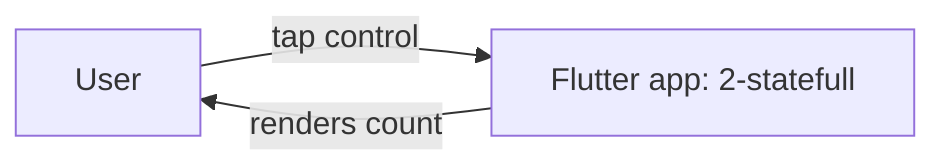
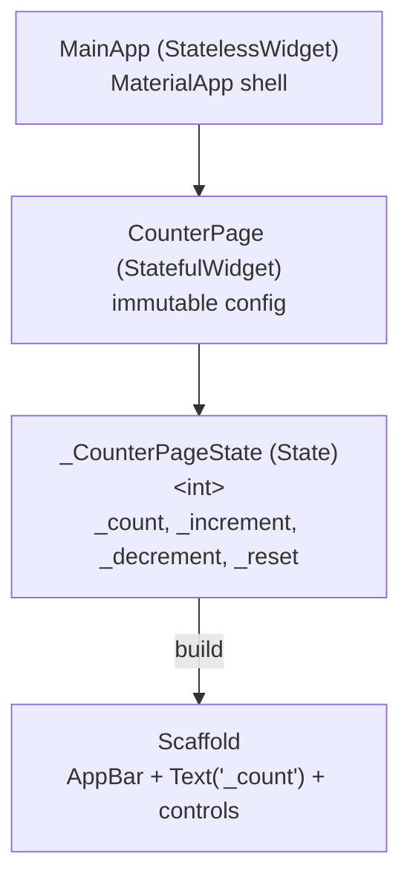
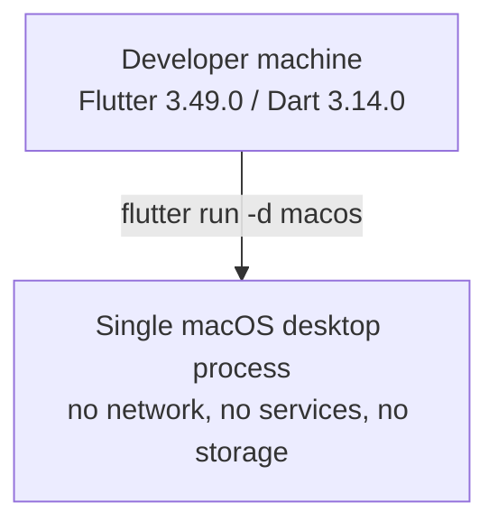

# Architecture Document — Flutter Stateful Widget Example ("2-statefull")

- **Intent ID**: `260930-create-new-flutter-2`
- **Inputs**: `requirements.md`, `feasibility-assessment.md`, `constraint-register.md`
- **Status**: proposed (Ideate)

## 1. Scope of This Architecture

A single Flutter application, ~60–90 lines in one file, that demonstrates the
framework's `StatefulWidget` / `State` / `setState` mechanism. There is no
network, no persistence, no routing, and no third-party runtime package. The
"architecture" here is deliberately the smallest structure that still shows the
pattern honestly; the risk is over-engineering, not under-engineering.

## 2. Architecture Questions and Decisions

Full question sheet in `architecture-questions.md`. Summary of the choices that
shape the design:

| Force | Decision | Requirement |
| --- | --- | --- |
| Where does mutable state live? | One `int` field on a `State<CounterPage>` object | FR-4 |
| How is it changed? | `setState` callbacks only | FR-4, CR-1 |
| File structure | All components in one `lib/main.dart` | NFR-4, CON-5 |
| Dependencies | Framework + official `material_ui` only | NFR-2, CON-2 |
| State scope | Local to the page; no lifting above `CounterPage` | CR-1 |

## 3. Options Considered

### Option A — Single `StatefulWidget` with inline UI **(chosen)**

One `StatefulWidget` owns the counter; its `State` builds the whole page.

- **Pros**: Smallest correct demonstration; one file; no indirection; every
  rebuild is explainable.
- **Cons**: Does not show how to lift state or keep a child stateless.
- **Decision**: Chosen. It matches the teaching goal and CON-5.

### Option B — `StatefulWidget` parent + stateless child display

Same `setState`, but the number is rendered by a separate `StatelessWidget`
that receives `count` as a constructor argument.

- **Pros**: Shows the stateless/stateful split and unidirectional data flow.
- **Cons**: Adds a second widget and a file-or-class boundary that a newcomer
  must hold in their head; two components for one integer.
- **Decision**: Rejected for this example — its lesson belongs in a later
  "composition" example, not the first state example.

### Option C — `ValueNotifier` + `ValueListenableBuilder`

Use `ValueNotifier<int>` and rebuild only the text.

- **Pros**: Shows finer-grained rebuilds.
- **Cons**: Introduces a second state primitive before `setState` is
  understood; the request explicitly says "Stateful pattern".
- **Decision**: Rejected — it answers a different question.

### Option D — Third-party state management (Provider/Riverpod/Bloc)

- **Decision**: Rejected on sight by CR-1 / CON-1; recorded so the exclusion is
  explicit rather than silent.

## 4. Context Diagram



The application has exactly one external actor and no external systems.

## 5. Component Diagram



## 6. Deployment Diagram



## 7. Responsibilities

| Component | Owns | Does **not** own |
| --- | --- | --- |
| `MainApp` (StatelessWidget) | App shell, `MaterialApp`, theme defaults, home wiring | Any mutable data |
| `CounterPage` (StatefulWidget) | Immutable widget configuration and identity | The counter value |
| `_CounterPageState` | `int _count`, all mutations, the UI built from it | Navigation, persistence, business rules beyond the counter |
| `lib/main.dart` | The whole example, end to end | Anything else — no other source files |

## 8. State and Data Flow

```
User taps Increment
      │
      ▼
onPressed callback (_increment)
      │  setState(() { _count += 1; })
      ▼
Flutter marks the State dirty and schedules a rebuild
      │
      ▼
build(context) re-runs → Text('$_count') shows the new value
```

- **State model**: `int _count = 0`. Every other value shown is derived
  (`'$_count'`), never stored.
- **Unidirectional**: UI events call methods; methods mutate state through
  `setState`; `build` reads state. No two-way binding, no observers.
- **Guards**: `_decrement` clamps at `0` (`if (_count > 0)`); `_reset` assigns
  `0`. Both run inside `setState` so the UI stays consistent with the field.
- **No async**: there are no futures, timers, or I/O, so there is no
  `mounted`-after-`await` hazard.

## 9. Failure Modes

| Failure | Likelihood | Effect | Handling |
| --- | --- | --- | --- |
| Decrement below zero | Medium (easy to tap) | Counter shows a negative value, contradicting FR-3 | Guard `if (_count > 0)` inside `setState`; covered by a widget test |
| State mutated outside `setState` | Low (review catches it) | UI does not rebuild; test fails | All mutations are in `setState`; FR-4 acceptance criterion + test |
| `BuildContext` used after dispose | None | n/a | No async work holds a context |
| Integer overflow | Negligible | n/a | Dart native ints are 64-bit; taps are bounded by human patience |
| Counter state lost on hot restart / relaunch | Expected | Value resets to `0` | Correct and documented: persistence is out of scope (CR-1) |
| Dependency drift breaks build | Low | Analyzer/test failure | Only official packages; `pubspec.lock` committed (REG-R3) |

## 10. Security Review (advisory — `security-agent`)

- **Trust boundaries**: one — between the user's taps and the app process.
  There is no network, no file system, no clipboard, no IPC, and no plugin.
- **Assets**: none of value. No credentials, PII, or telemetry.
- **STRIDE**: not applicable beyond denial-of-service by the user on their own
  machine; no spoofing, tampering, repudiation, information disclosure, or
  elevation paths exist in the design.
- **Input validation**: the only input is button activation; no strings are
  accepted or parsed.
- **Supply chain**: runtime surface is the Flutter SDK plus official Flutter
  packages (`material_ui` and its Flutter-team dependencies). No third-party
  code is introduced. `pubspec.lock` is committed.
- **Findings**: none blocking. Advisory: keep the app free of permission-adding
  plugins and platform entitlements; the generated macOS sandbox entitlements
  should remain the defaults.

## 11. Requirement Coverage

| Requirement | Where satisfied |
| --- | --- |
| FR-1 initial `0` | `_CounterPageState._count = 0`; `build` |
| FR-2 increment | `_increment` + `setState` |
| FR-3 decrement/reset, floored | `_decrement` guard, `_reset` |
| FR-4 `State` + `setState` | `_CounterPageState` |
| FR-5 project structure | `2-statefull/flutter_application_2/` |
| FR-6 widget test | `test/` (see Technical Specification) |
| FR-7 README | `2-statefull/README.md` |
| NFR-1 local toolchain | No platform plugins; generated project |
| NFR-2 minimal footprint | Dependencies = framework + official packages |
| NFR-3 analysis | Default `analysis_options.yaml` |
| NFR-4 readability | Single file, three small classes |
| CR-1 built-in only | `State`/`setState`; no packages |
| CR-2 `2-statefull` | Directory convention |

No unmapped must-have.

## 12. Rejected Options (recorded)

- Option B (stateful + stateless split) — deferred to a later example.
- Option C (`ValueNotifier`) — different lesson.
- Option D (third-party state management) — forbidden by CR-1.
